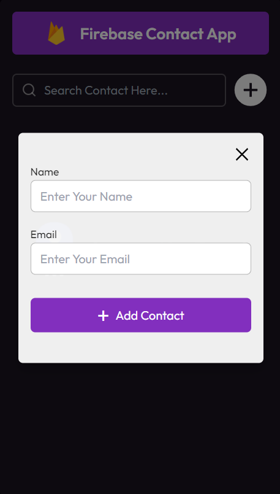

# Firebase Contact App with React

Welcome to the Firebase Contact App repository! This project is a React-based web application designed to manage user contact information using Firebase as the backend database. Built with React, it utilizes the `useState`, `useEffect` hooks, and props for state management and rendering components. The app allows users to add, edit, and delete contacts, with form validation and search functionality. The modern UI design enhances the overall user experience, making it intuitive and visually appealing.

## Preview

### 1. Adding Contact



### 2. Edit Contact


### 3. Delete Contact with Toast Message


### 4. Validation white adding or updating contacts


### 5. Stores in an Organized Manner


### 6. Empty Component When There Is No Data


## Features

- **Add Contacts:** Easily add new contacts with form validation.
- **Edit Contacts:** Modify existing contacts to update information.
- **Delete Contacts:** Remove unwanted contacts with a confirmation toast message.
- **Search Functionality:** Search contacts by name or email for quick access.
- **Firebase Integration:** Store contact data in Firebase for seamless data management.
- **Modern UI Design:** Sleek layout and visually appealing design for an enjoyable user interface.

## Getting Started

To run the Firebase Contact App locally, follow these steps:

1. Clone the repository to your local machine:

   ```bash
   git clone https://github.com/Devsethi3/Firebase-Contact-App.git
   ```

2. Navigate to the project directory:

   ```bash
   cd firebase-contact-app
   ```

3. Install the dependencies:

   ```bash
   npm install
   ```

4. Start the development server:

   ```bash
   npm start
   ```

5. Open your web browser and visit [http://localhost:3000](http://localhost:3000) to use the app.

## Usage

1. Enter contact details in the input fields and click "Add Contact" to add a new contact.
2. Click on a contact to view its details and options to edit or delete it.
3. Use the search bar to filter contacts by name or email.
4. Click the "Edit" button to modify a contact's information.
5. Click the "Delete" button to remove a contact from the list, with a confirmation toast message displayed.
6. Contacts are stored in Firebase for persistent data management.

## Customization

Feel free to customize this project to fit your preferences. Update styles, colors, and layout in the React components and CSS files. You can also extend the functionality to include additional features or customization options.

## Contributing

If you'd like to contribute to this project, please follow these steps:

1. Fork the repository.
2. Create a new branch for your feature or improvement.
3. Make your changes and commit them with descriptive messages.
4. Push your changes to your forked repository.
5. Open a pull request to merge your changes into the main branch.

Explore the Firebase Contact App, manage your contacts effortlessly, and consider contributing to its development. Thank you for checking out the repository!
